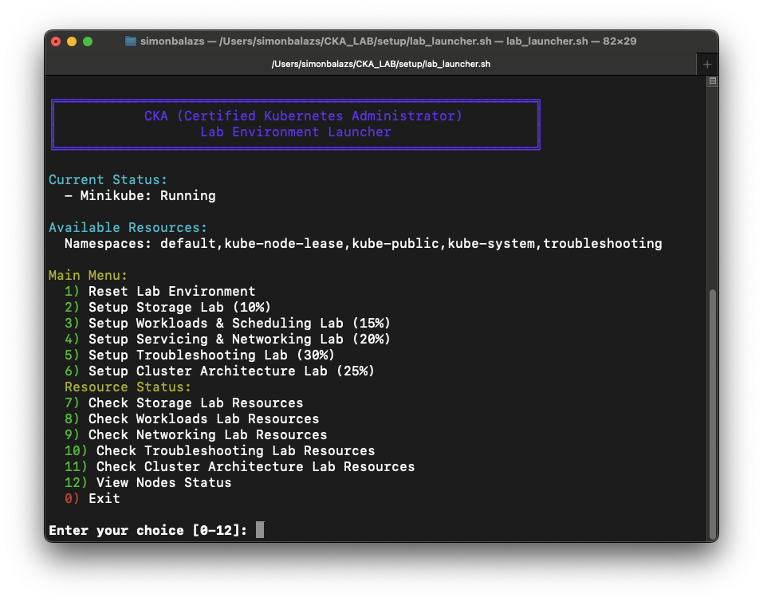

# CKA Lab Environment Launcher TUI Guide

This guide provides detailed instructions for using the Text-based User Interface (TUI) launcher for the CKA Lab Environment.

## Overview

The `lab_launcher.sh` script provides an interactive, color-coded menu interface to manage all aspects of your CKA lab environments. It simplifies the process of setting up, managing, and checking the status of your Kubernetes resources for exam preparation.



## Features

### 1. Status Display

The TUI automatically displays:
- Current Minikube status (Running/Not Running)
- Available namespaces in the cluster

### 2. Lab Environment Management

- **Reset Lab Environment**: Deletes and restarts your Minikube instance with appropriate settings
- **Setup Domain-specific Labs**: Launch individual setup scripts for each CKA exam domain:
  - Storage (10%)
  - Workloads & Scheduling (15%)
  - Servicing & Networking (20%)
  - Troubleshooting (30%)
  - Cluster Architecture (25%)

### 3. Resource Monitoring

- **Check Lab Resources**: View pods, services, and deployments in each namespace:
  - Storage Lab Resources
  - Workloads Lab Resources
  - Networking Lab Resources
  - Troubleshooting Lab Resources
  - Cluster Architecture Lab Resources
- **View Nodes Status**: Check the status of all Kubernetes nodes

## Usage Instructions

### Starting the TUI

1. Navigate to the setup directory:
   ```bash
   cd /path/to/CKA_LAB/setup
   ```

2. Ensure the script is executable:
   ```bash
   chmod +x lab_launcher.sh
   ```

3. Launch the TUI:
   ```bash
   ./lab_launcher.sh
   ```

### Navigating the Menu

1. Use the numeric keys (0-12) to select menu options
2. Press Enter to confirm your selection
3. Follow the on-screen prompts

### Typical Workflow

1. Start by selecting option 1 to reset the lab environment (if needed)
2. Select one of the setup options (2-6) to prepare a specific lab environment
3. Use the resource status options (7-11) to verify the resources are correctly created
4. Exit the TUI using option 0 when finished

## Keyboard Shortcuts

- Enter key: Confirm selection
- Ctrl+C: Exit TUI (emergency exit, prefer using menu option 0)

## Troubleshooting

- **TUI doesn't display colors properly**: Ensure your terminal supports ANSI color codes
- **Menu options not responding**: Check if you have proper permissions in the directory
- **Resource status shows "No connection to cluster"**: Ensure Minikube is running

## Customization

Advanced users can modify the `lab_launcher.sh` script to:
- Add additional resource types to monitor
- Change color schemes
- Add new menu options for custom tasks

## About

This TUI launcher was created to simplify the CKA exam preparation process by providing a user-friendly interface to the lab environment setup scripts. It helps you focus on learning Kubernetes concepts rather than managing your lab environment.
